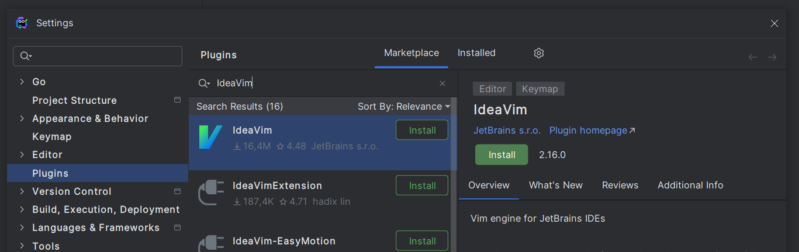

## Some main reasons why you should learn Vim or Vim Motions at least

- Your thought process will mostly be a straight line, no interruptions, like
  having to reach the mouse just to fix some stupid piece of code (this may
  sound trivial but it's the most annoying part when I code)
- Improve coding speed a little bit (or a lot faster If you use it long enough)
- Vim Motions are easier to remember than IDE shortcuts.
- Vim is pre-installed on most servers you SSH into (let's pretend Nano isn't here)

There are already plenty of resources about `Vim` and `Vim Motions` online. You
can do some quick research and use it to config `Vim in Jetbrains IDE` like I
mention here:
[Vim for Jetbrains IDE](#bonus-how-to-install-ideavim-for-jetbrains-ide-and-config)

With that being said. This series mostly talks about important plugins in
`Neovim` and it's most confusing configuration. (yikes 💀)

***btw... below is a side story of how I came to know Vim and my journey of
learning Vim, you can skip to [Part 2](#todo) if you don't want to read it 👉***

---

It was a great day, while I was watching Youtube I came across a video:



wtf, How can he be that fast? meanwhile I'm still struggling spamming `Ctrl +
Arrow` non-stop, reach for `Home`, `End` key to move around the line in IDE.

## 1. It feels so hard and I can't withstand it

With that curiousity. I try to install and learn how to use `Neovim`... The
result? kind of disappointing when I can't even move around properly using
`hjkl` keys, it just feels so hard to be begin with. As a result, I quit using 
it after the first 2 hours. 

## 2. Try again with Vim inside Jetbrains IDE

About one month later. I discovered that I can use `Vim` inside those popular 
IDE like `VS Code` and `Jetbrains IDE`. So I decided to give it another try 
with `IdeaVim plugin` in [Goland](https://www.jetbrains.com/go/)

The result seems promising, my coding speed with Vim is slower than normal but
it's increasing steadily. After 1 month forcing myself to use it and tinkering
around the config I noticed my coding speed is significantly faster than before.
Now I know why Vim Motions are like this, it's much easier to remember and more
intuitive to use.

## 3. Feeling I'm capable of using Neovim

* After a long enough time with `IdeaVim`. I decided to switch to `Neovim`,
  starting with some tutorial and collecting individual plugins (sounds very
  similar to VS Code but need a lot more configuration ). Finally, I have a complete setup for my current job.

* Neovim allows you to change it pretty much everything alongside with lot of
  community plugins, so it's very easy to over-engineer the config, making it
  quite time-consuming to fix things when plugins have breaking-changes.
  Personally I prioritize using default as much as possible and only config the
  things I truly need and try not to install too many random plugins.

## Bonus: How to install IdeaVim for Jetbrains IDE and config

**tl;dr:** this plugin mimics some capabilities of Vim inside Jetbrains IDE. It
can be called a `Vim Emulator` 

1. Settings -> Marketplace -> Find `IdeaVim` and install it:


2. Create a config file `.ideavimrc` at:
- On Linux/MacOS: `~/.ideavimrc`
- On Windows: `C:\Users\<your-username>\.ideavimrc`

3. Paste the following:
```vim
set clipboard+=unnamed
set surround
set ideajoin

" jk to exit Insert mode
inoremap jk <Esc>
" use Ctrl-J to move down 5 lines
nnoremap <C-j> 5j 
" use Ctrl-K to move up 5 lines
nnoremap <C-k> 5k
```

