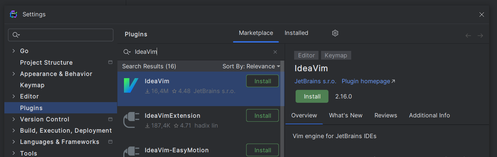

## Một số lý do chính tại sao bạn nên học Vim hoặc ít nhất là Vim Motions

- Dòng suy nghĩ khi code sẽ liền mạch hơn, không bị ngắt quãng như khi bạn phải
  với lấy con chuột để chỉ để sửa 1 vài cái linh tinh (cái này nghe có vẻ đơn
  giản nhưng mình nghĩ nó là cái khó chịu nhất khi mình code)
- Code nhanh hơn một tí (hoặc nhiều tí nếu bạn xài đủ lâu).
- Vim Motions dễ nhớ hơn shortcut của IDE rất nhiều.
- Vim được cài sẵn ở hầu hết các server bạn SSH vào (hi vọng Nano user không 
cho mình ăn gạch )

Về Vim Motions và các khái niệm cơ bản của Vim thì trên mạng đã có rất nhiều
rồi, bạn có thể tham khảo và áp dụng để config **Vim hàng fake** như mình đã đề
cập ở đây:
[Vim dành cho Jetbrains IDE](#bonus-cài-plugin-ideavim-cho-jetbrains-ide-và-config)

Vì vậy series này sẽ chỉ tập trung nói về những plugin quan trọng trong 
`Neovim` và những config rối nhất của nó (yikes 💀)

***btw... dưới đây là câu chuyện bên lề mình biết tới Vim như thế nào và quá trình
lĩnh hội Vim, bạn có thể skip qua [Part 2](#TODO) không cần coi cũng được 👉***

---

Vào một ngày đẹp trời, trong khi đang lướt youtube thì mình bắt gặp một video
kiểu như thế này:  



wtf, tại sao lại có thể edit nhanh như vậy? trong khi nhìn lại mình thì vẫn
đang chật vật spam `Ctrl + phím mũi tên` để di chuyển, dùng chuột chọc code
trong IDE.

## 1. Bỏ cuộc vì quá khó.

Trong sự tò mò đó thì mình cũng mò mẫm cài thử `neovim` và mò cách sử dụng...
Kết quả thì thực sự làm quen với vim rất khó, việc sử dụng `hjkl` để di chuyển
thay cho phím mũi tên cộng với việc phải chuyển mode liên tục khiến mình rất
khó chịu và sượng tay. Vì vậy sau 1-2 tiếng mò mẫm và làm quen thì mình quyết
định từ bỠbộ môn này. 

## 2. Thử lại với Vim trong Jetbrains IDE

Khoảng 1 tháng sau lần thất bại đó thì mình tìm hiểu được là có thể sử dụng
`Vim` trong chính những editor phổ biến hiện nay như `VS Code`, `Jetbrains
IDE`. Vì vậy nên mình quyết định cài plugin `IdeaVim` cho Jetbrains IDE và thử
lại một lần nữa. `Jetbrains IDE` mà mình đang nhắc đến ở đây cụ thể là
[Goland](https://www.jetbrains.com/go/)

Kết quả có vẻ khả quan hơn lần trước, tốc độ code của mình ban đầu chậm hơn so
với khi không dùng `Vim` nhưng được cải thiện dần dần. Sau khoảng 1 tháng tinh
chỉnh, làm quen thì tốc độ nhanh hơn rõ rệt và không còn bị cảm giác khó chịu
khi phải spam phím hoặc với chuột để thao tác. 

## 3. Chuyển qua ăn hành cùng Neovim...

* Sau một khoảng thời gian đủ lâu thì mình quyết định chuyển sang dùng `Neovim`
  hàng real và bắt đầu quá trình góp nhặt những plugin đơn lẻ (khá giống VS
  Code nhưng cần config nhiều hơn...) thành một bộ setup hoàn chỉnh để phục vụ
  cho công việc hiện tại của mình.

* Neovim cho phép bạn tuỳ biến rất sâu cũng như nhiều plugin để lựa chọn nên
  đôi khi một số người sẽ "config" quá đà (aka nghiện config) nên khi
  plugin có **breaking changes** thì việc fix lại khá tốn thời gian. Bản thân
  mình thì sẽ ưu tiên mặc định nhiều nhất có thể và chỉ config những cái mà
  mình cảm thấy thật sự cần + không cài quá nhiều plugin linh tinh

## Bonus: Cài plugin IdeaVim cho Jetbrains IDE và config

tl;dr: đây là plugin mô phỏng lại một phần những gì Vim có thể làm được 
trong chính Jetbrains IDE. Cũng có thể nói đây là hàng fake

1. Settings -> Marketplace tìm `IdeaVim` và cài như bình thường 


2. Tạo file config `.ideavimrc` ở đường dẫn sau:
- Trên Linux/MacOS: `~/.ideavimrc`
- Trên Windows: `C:\Users\<username của bạn>\.ideavimrc`

3. Paste đoạn config mẫu này vào: 
```vim
set clipboard+=unnamed
set surround
set ideajoin

" jk để thoát insert mode
inoremap jk <Esc>
" dùng Ctrl-J để di chuyển xuống 5 dòng
nnoremap <C-j> 5j 
" dùng Ctrl-K để di chuyển lên 5 dòng
nnoremap <C-k> 5k
```


