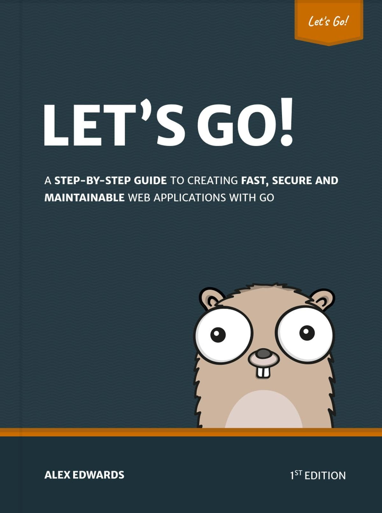

[Let's Go by Alex Edwards](https://lets-go.alexedwards.net/)

[Let's Go Further by Alex Edwards](https://lets-go-further.alexedwards.net/)

[100 Go Mistakes and How to Avoid Them by teivah](https://100go.co/book/)

[Concurrency in Go by Cox-Buday](https://www.oreilly.com/library/view/concurrency-in-go/9781491941294/)

