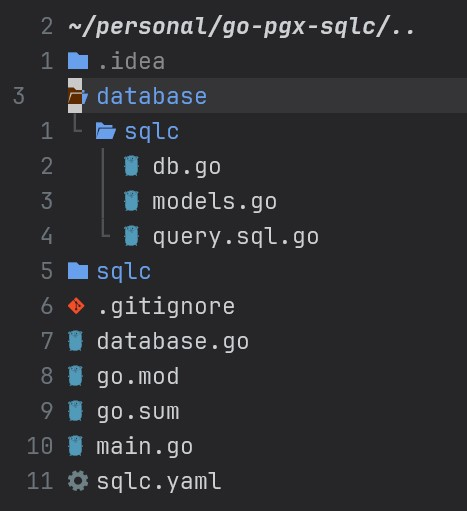

## What is pgx and sqlc? 

- [pgx](https://github.com/jackc/pgx): a robust toolkit and PostgreSQL driver
  for Golang. This module also provides some useful tool for handling complex
      queries easier and less error-prone.
- [sqlc](https://github.com/sqlc-dev/sqlc): a code generator tool that turns
  your SQL queries in `.sql` files into Go code with type-safe for both query
  params and query result. Check out an example here: [sqlc
  playground](https://play.sqlc.dev/). sqlc also <mark>supports pgx out of the
  box</mark>, which makes this a great combination for your database's need.

## Why the combination of pgx and sqlc? 

Although you may want to use some alternative solution like
[GORM](https://github.com/go-gorm/gorm) (A Database ORM in Go), It seems like
an easy choice to implement and use, plus you don't have to write SQL. Sounds
too good to be true... but here's the catch:

Based on my experience, almost all `ORM` I have ever used only perform well in
easy scenarios (eg `CRUD operation`). The more complex your query gets, the
harder to implement properly in these `ORM`, sometime it's even harder than
writing raw query manually (try adding an upsert or
[CTE](https://www.postgresql.org/docs/current/queries-with.html)),
to the point you have to pull out the big gun... yes, you grab the database
driver under the wrapper and start writing raw query, map the types manually
and questioning yourself why you chose to use an ORM in the first
place. 

Another foot gun of `ORM` is that you generally can't control the `SQL query`
they produce, they may do dumb things and write terrible queries. Here's a funny 
story about `Prisma ORM` in javascript world: [video](https://youtu.be/jqhHXe746Ns)

A balance spot between `error-prone, untyped raw query` and `ORM` is `query
builder`. They provide some sort of type safety and the flexibility to build
and optimize complex query.

### Usage of sqlc

`sqlc` is not exactly a query builder but a code generator that reads your
queries and schema in `.sql` files and turns it into type-safe code for both
query params and query result, for example:

It turns this query: (note that the comment is mandatory)
```sql
-- name: CreateAuthor :one
INSERT INTO author (name, bio)
VALUES (lower(@name), @bio)
RETURNING *;
```

Into this type-safe Go code, ready to use:
```go
const createAuthor = `-- name: CreateAuthor :one
INSERT INTO author (name, bio)
VALUES (lower($1), $2)
RETURNING id, name, bio
`

type CreateAuthorParams struct {
	Name string      `db:"name" json:"name"`
	Bio  pgtype.Text `db:"bio" json:"bio"`
}

func (q *Queries) CreateAuthor(ctx context.Context, arg CreateAuthorParams) (Author, error) {
	row := q.db.QueryRow(ctx, createAuthor, arg.Name, arg.Bio)
	var i Author
	err := row.Scan(&i.ID, &i.Name, &i.Bio)
	return i, err
}
```

So it should provide a similar experience to using a `query builder`: You can
write things that are close to SQL queries and have the types mapped
automatically

### Usage of pgx

There's even more complex query that neither `query builder` nor `sqlc` can
handle. This is where you can use `pgx` to handle these specific complex
query. 

`pgx` also comes with plenty of useful tools which made it easier to
write raw SQL: 

#### 1. Named argument & collect rows:

* **Named arguments** (@id, @name, @description...) as placeholder instead of
  positional placeholder ($1, $2, $3...):
  [pgx.NamedArgs](https://pkg.go.dev/github.com/jackc/pgx/v5#NamedArgs)
* **Collect rows to array of struct** using helper function instead of scanning
  manually:
  [pgx.RowToStructByName](https://pkg.go.dev/github.com/jackc/pgx/v5#RowToStructByName)

*Insert with named argument*
```go
type Author struct {
	Id   int         `db:"id"`
	Name string      `db:"name"`
	Bio  pgtype.Text `db:"bio"`
}

func pgxInsert(db *database.Database, name string, bio pgtype.Text) (Author, error) {
	// use named arguments instead $1, $2, $3...
	query := `INSERT INTO author (name, bio) VALUES (@name, @bio) RETURNING *`
	args := pgx.NamedArgs{
		"name": name,
		"bio":  bio,
	}
	rows, err := db.Pool.Query(context.Background(), query, args)
	if err != nil {
		return Author{}, nil
	}
	defer rows.Close()

	// use collect helper function instead of scanning rows
	return pgx.CollectOneRow(rows, pgx.RowToStructByName[Author])
}
```

*Select and collect one row*
```go
func pgxSelect(db *database.Database, id int) (Author, error) {
	// notice that I dont select id
	// and use RowToStructByNameLax to allows some of the column missing
	query := `SELECT name, bio from author where id = @id`
	args := pgx.NamedArgs{
		"id": id,
	}

	rows, err := db.Pool.Query(context.Background(), query, args)
	if err != nil {
		return Author{}, err
	}
	defer rows.Close()

	return pgx.CollectOneRow(rows, pgx.RowToStructByNameLax[Author])
}
```

*Select, collect and append to slice*
```go
func pgxSelectAllId(db *database.Database) ([]int, error) {
	query := `SELECT id from author`

	rows, err := db.Pool.Query(context.Background(), query)
	if err != nil {
		return []int{}, err
	}
	defer rows.Close()

    // use this if you dont need appending to slice
    // idArr, err := pgx.CollectRows(rows, pgx.RowTo[int])
	idArr := []int{}
	idArr, err = pgx.AppendRows(idArr, rows, pgx.RowTo[int])
	if err != nil {
		return []int{}, err
	}

	return idArr, nil
}
```

#### 2. Bulk insert with [Postgres's COPY](https://www.postgresql.org/docs/current/sql-copy.html):

```go
func pgxCopyInsert(db *database.Database, authors []Author) (int64, error) {
	rows := [][]any{}
	columns := []string{"name", "bio"}
	tableName := "author"

	for _, author := range authors {
		rows = append(rows, []any{author.Name, author.Bio})
	}

	return db.Pool.CopyFrom(
		context.Background(),
		pgx.Identifier{tableName},
		columns,
		pgx.CopyFromRows(rows),
	)
}
```

Examples can be found here: [Github
repo](https://github.com/remvn/go-pgx-sqlc/blob/main/database/database_test.go)

### Summary 

In a typical Golang project I will use:
- `sqlc` for `CRUD` operation and simple query.
- `pgx` for some specific complex query that `sqlc` can't parse. 

## Pgx and sqlc tutorial

Source code of this tutorial can be found here: [Github
repo](https://github.com/remvn/go-pgx-sqlc)

### 1. Add pgx and install sqlc

You will use `sqlc` as a cli tool for generating go codes, please install
`sqlc` using this following guide from official docs: [install
sqlc](https://docs.sqlc.dev/en/stable/overview/install.html)

Add pgx package to your Go module
```bash
go get github.com/jackc/pgx/v5
```

### 2. Create a directory to store query and schema files.

`./sqlc/schema.sql`
```sql
CREATE TABLE author (
    id   SERIAL PRIMARY KEY,
    name VARCHAR(100) NOT NULL UNIQUE,
    bio  TEXT
);
```

`./sqlc/query.sql`
```sql
-- name: GetAuthor :one
SELECT *
FROM author
WHERE id = $1
LIMIT 1;

-- name: ListAuthors :many
SELECT *
FROM author
ORDER BY name;

-- name: CreateAuthor :one
INSERT INTO author (name, bio)
VALUES (lower(@name), @bio)
RETURNING *;
```

### 3. Create sqlc config and generate code: 

`sqlc.yaml` at project's root 
```yaml
version: "2"
sql:
  - engine: "postgresql"
    queries: "sqlc/query.sql"
    schema: "sqlc/schema.sql"
    gen:
      go:
        package: "sqlc" # Package name
        out: "database/sqlc" # Output folder
        sql_package: "pgx/v5" # Use sql types provided by pgx
        emit_json_tags: true
        emit_db_tags: true # this helps pgx scan struct using types generated by sqlc
```

Run this command to generate code: 
```bash
sqlc generate
```

Check the files generated by sqlc: 


### 4. Create a database package to wrap pgx and sqlc

`./database/database.go`
```go
package database

import (
	"context"
	"log"

	"github.com/jackc/pgx/v5/pgxpool"
	"github.com/remvn/go-pgx-sqlc/database/sqlc"
)

type Database struct {
	Pool  *pgxpool.Pool
	Query *sqlc.Queries
}

func NewDatabase(connStr string) *Database {
	// this only create pgxpool struct, you may need to ping the database to
	// grab a connection and check availability
	pool, err := pgxpool.New(context.Background(), connStr)
	if err != nil {
		log.Fatal(err)
	}

	// this is generated by sqlc cli
	query := sqlc.New(pool)

	database := Database{
		Pool:  pool,
		Query: query,
	}
	return &database
}
```

### 5. Pgx and sqlc in action  

Please check out this code: 
[database_test.go](https://github.com/remvn/go-pgx-sqlc/blob/main/database/database_test.go)

If you has docker installed, clone the repo and run this command:
```bash
go test -v ./... 
```

With the implementation of [testcontainer for
go](https://golang.testcontainers.org/), it will create a postgres container on
the fly and run integration test on that database!

